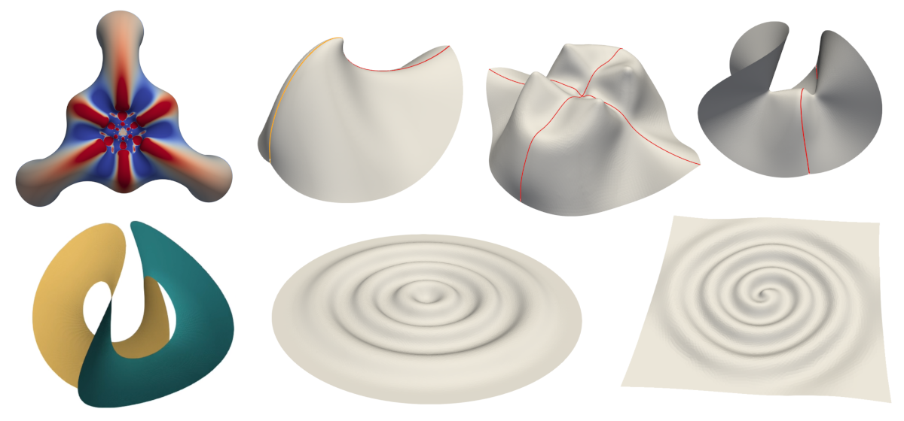
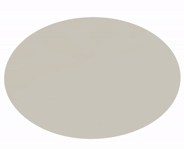
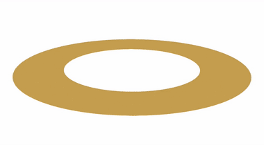
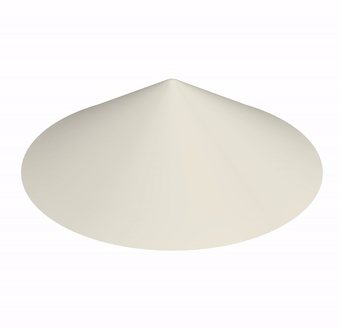

<!-- Here's how you comment out a bit 
of Markdown on Github. -->
<!--
https://docs.github.com/en/get-started/writing-on-github/getting-started-with-writing-and-formatting-on-github/quickstart-for-writing-on-github
-->

<!--

  
  
The worst mesh generator you'll ever use.

-->

<!--
The following worked to embed a video (following https://bobbyhadz.com/blog/embed-video-into-github-readme-markdown), but any resizing of the video seemed to do nothing --- when actually viewing the README page the video just fills the width no matter what, which is far too big. So I went with gifs instead.
-->
<!-- To generate the video link, I just drag-and-dropped the video from my computer onto the editing window for the README that you get to just by clicking on README in the repo then clicking the little pencil icon to edit it. When you drag-drop like that, github stores the video outside your repo on its servers, and automatically puts the correct link into your markdown. Then I went to the usual dev editor to fine tune, controlling the width with html syntax etc. -->
<!-- 
<video width="60" height="20" src="https://github.com/Daniel-Duffy/MorphoShell/assets/70776477/268777c7-d92c-4971-817f-fbe9f3e3519b"></video>
-->

<h2>MorphoShell: Simple Simulation Software for Shape-Shifting Shells</h2>

[This project is still under construction! In the meantime, I'm always happy to help if you want to get MorphoShell up and running right now though; my email address is in the MorphoShell handbook.]

MorphoShell simulates elastic shells as they deform. It calculates forces from an elastic stretch+bend energy, and evolves a triangulated mesh accordingly, via damped Newtonian dynamics. Such dynamics are more directly physical than those in many other codes, which is good for both understanding your results and making nice videos of them: 

 
   

The code is especially aimed at "shape-programmed" shells (left and middle), which start flat but then develop a preferred metric and/or curvature as they are "activated"; a growing leaf being a familiar example. However more traditional simulations also work well; in the right-hand video [a cone is squashed](https://doi.org/10.1103/PhysRevLett.131.148202) and then unsquashed.  

MorphoShell first appeared alongside a 2020 paper ([Defective Nematogenesis](https://doi.org/10.1039/D0SM01192D)) by John Biggins and myself, but this github version is more up-to-date. It's written in c++, but is designed to be pretty friendly to use and modify, even for inexperienced coders. John and I wrote it because we couldn't find any good, easy-to-use software for shape-programmed shells. The philosophy is to be as simple as possible while getting the job done; the code's not supposed to be a black box, nor extremely general, nor impressively fast, nor particularly feature rich. It's served us extremely well in [our research](https://danielduffy.org/publication/). The target audience is broad, but I particularly aiming at physicists who may be intimidated by the idea of running simulations themselves, or just don't want to spend loads of time coding. You should be able to use MorphoShell even if you have almost no experience writing or running code!

My c++ source files are distributed here under the Cambridge Academic Software License (CASL), which very roughly means that if you're an academic the license is a lot like GPL, while if you're at a company or in any commercial setting, you'll need to come to another arrangement with me. For meshing, I use a Python implementation of the DistMesh algorithm; I provide the necessary scripts in the repo under a GPL license. For visualisation I recommend ParaView, which is excellent and free. 

To download the repo, click the green "<> Code" button near the top of this web page, then "Download ZIP". Please get in touch if you have any problems using the code: daniellouisduffy&nbsp;\[AT\]&nbsp;gmail&nbsp;\[DOT\]&nbsp;com.

For detailed instructions on how the code works and how to use it, please see the MorphoShell Handbook, which is included in the repo, or this [instructional video](https://danielduffy.org):  

VIDEO COMING SOON!!  

<!--
### Section 1
-->

